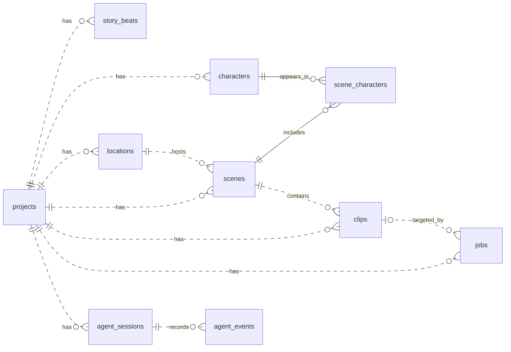
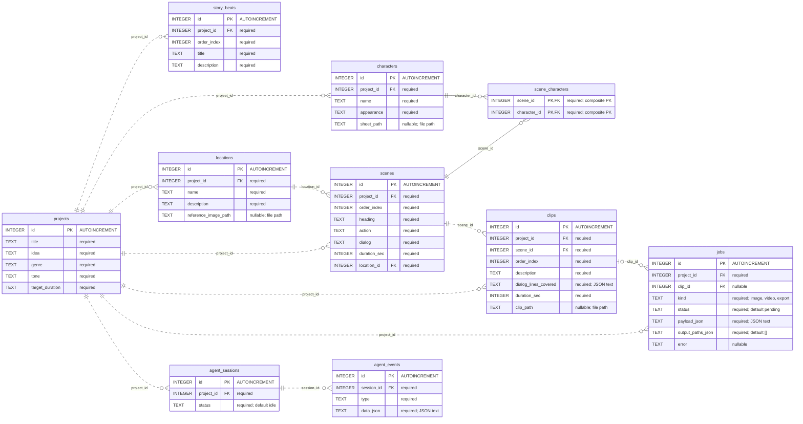

# Mini Calliope: Database Map

[Playground reference](../README.md) | [Learning guide](README.md)

This guide maps the SQLite schema declared in
[`calliope-backend\src\calliope\db.py`](../calliope-backend/src/calliope/db.py):
**10 application tables, 54 columns, and 13 foreign keys**. It distinguishes
database-enforced relationships from conventions implemented in Python.

The diagrams describe the current source schema, not an inspection of a saved
database. `migrate_db()` uses `CREATE TABLE IF NOT EXISTS`; it does not alter
existing table definitions. SQLite's internal `sqlite_sequence` table is not an
application entity and is excluded from the diagrams.

Open this file in a Markdown preview with Mermaid support to see the rendered maps.

## 1. The model at a glance

**A project is the root record.** Its story, cast, locations, scenes, clips, jobs,
and agent sessions belong to that project. Scene-character links and agent events
reach the project indirectly through their parent records.

| Area | Tables | Responsibility |
|---|---|---|
| Project and story | `projects`, `story_beats`, `characters`, `locations` | Store the creative brief, ordered story beats, cast, and settings. |
| Script and coverage | `scenes`, `scene_characters`, `clips` | Store scene text, cast membership, and the shot plan. |
| Execution and conversation | `jobs`, `agent_sessions`, `agent_events` | Track queued work and persist agent interaction history. |

### Relationship overview

Read each connection from the parent on the left of its definition to the child
on the right. A parent can exist before any of its child records are created.



### How to read the notation

| Symbol | Meaning |
|---|---|
| `\|\|` | Exactly one record at this end. |
| `\|o` or `o\|` | Zero or one record at this end. |
| `o{` or `}o` | Zero or many records at this end. |
| `..` | Non-identifying relationship: the child has its own primary key. |
| `--` | Identifying relationship: the foreign key forms part of the child's primary key. |
| `PK` / `FK` | Primary key / foreign key. `PK, FK` means both. |

**Dashed lines are still real foreign keys**, not informal associations. Their
line style describes identity, not whether SQLite enforces the relationship.

For example, `scenes ||..o{ clips` means each clip must reference exactly one
scene, while a scene may have zero or many clips. `clips |o..o{ jobs` means a job
may reference no clip or one clip; the same clip may have multiple jobs.

## 2. Complete table and column map

Every declared application column appears below. Relationship labels name the
**foreign-key column in the child table**; each references the parent's `id`.
`required` means `NOT NULL`. Each `id` is an
`INTEGER PRIMARY KEY AUTOINCREMENT`; SQLite generates it when omitted.



## 3. The important mappings, explained

### Project ownership is explicit, but consistency also depends on Python

Seven tables store their own `project_id`: `story_beats`, `characters`,
`locations`, `scenes`, `clips`, `jobs`, and `agent_sessions`.

Some records have more than one route to a project. For example, a clip has its
own `project_id` and also reaches a project through `scene_id`. SQLite checks
that both referenced records exist; **it does not check that they belong to the
same project**. There are no composite ownership foreign keys or triggers.

The application supplies or checks the matching project IDs during scene
generation, job creation, and rendering. The same distinction matters for a
scene's location, its cast, and a job's optional clip. Direct SQL can bypass
those application-level checks.

### Scenes and characters have a many-to-many relationship

`scene_characters` is the junction table:

```text
scenes.id <- scene_characters.scene_id
characters.id <- scene_characters.character_id
```

Its primary key is the **pair** `(scene_id, character_id)`, not two independent
primary keys. Both columns are required. This prevents assigning the same
character to the same scene twice, while allowing a scene to contain many
characters and a character to appear in many scenes.

The junction has neither an `id` column nor a `project_id` column.

### A story beat is not directly linked to a scene

Story beats guide script generation, but there is **no `beat_id` on `scenes`**
and no beat-scene junction table. The application currently creates as many
scenes as there are beats, using the story as generation context.

That workflow is not a database-enforced one-to-one relationship. Do not join
beats and scenes by equal IDs or assume matching `order_index` values establish
a foreign key.

### A planned clip is not yet a rendered video

`clips` stores a shot plan: description, duration, and dialogue coverage.
`clip_path` can be `NULL` until a video job attaches an output.

`ensure_default_clip()` creates one initial clip for each newly saved scene.
Coverage expansion then **deletes and replaces** the scene's clip rows, so clip
IDs can change. The coverage operation rejects projects that already have jobs
to preserve render links. These are application behaviors; the schema alone
does not require a scene to have a clip.

### Jobs have both relational and JSON-based targets

| Job kind | How the application identifies its target | Where the result is recorded |
|---|---|---|
| `image` for a character | `payload_json.target` contains `kind: "character"` and the character's `id`; this is **not an FK**. | First output path is attached to `characters.sheet_path`. |
| `image` for a location | `payload_json.target` contains `kind: "location"` and the location's `id`; this is **not an FK**. | First output path is attached to `locations.reference_image_path`. |
| `video` for a saved clip | `jobs.clip_id` references `clips.id`; the video enqueue flow supplies it. | First output path is attached to `clips.clip_path`. |
| `export` | `jobs.project_id` identifies the project. | The worker records the export-manifest path in `jobs.output_paths_json`; there is no exports table. |

All successful jobs record their output paths in `jobs.output_paths_json`.
An image job can also be queued without an entity target; in that case no
character or location path is updated.

At the SQL level, `clip_id` is nullable for **every** job kind. No constraint
requires a video job to have a clip or prohibits an image/export job from
referencing one. Those distinctions are application conventions.

### Agent events belong to a session, not directly to a project

The ownership path is `agent_events.session_id -> agent_sessions.id`, followed
by `agent_sessions.project_id -> projects.id`. Events have no `project_id`.

Events store their category in `type` and structured content in `data_json`.
The application reads them in `id` order; there is no timestamp column.
Conversation history is derived from `message` events. A tool may create jobs,
but there is **no relational session-to-job or event-to-job foreign key**.

## 4. Storage rules and boundaries

| Topic | Exact behavior |
|---|---|
| Foreign-key enforcement | `get_db()` enables `PRAGMA foreign_keys = ON` on each application connection. External SQLite consoles must enable it on their own connections. |
| Delete and update actions | All 13 FKs use SQLite's default `NO ACTION`. There is no `ON DELETE CASCADE` or `ON UPDATE CASCADE`; deleting referenced parents can fail. |
| SQL defaults | `jobs.status = 'pending'`, `jobs.output_paths_json = '[]'`, and `agent_sessions.status = 'idle'` are the only explicitly declared `DEFAULT` clauses. |
| Job kinds | `jobs.kind` has `CHECK (kind IN ('image', 'video', 'export'))`. |
| Status values | Job code uses `pending`, `running`, `done`, and `failed`. Session code uses `idle`, `running`, `completed`, `error`, and `step_limit`. Neither status column has a SQL enum or `CHECK`. |
| Ordering | Story beats and scenes use `order_index` within a project; clips use it within a scene. These ordering columns are neither unique nor range-checked in SQL. An `id` is identity, not display order. |
| Dialogue coverage | `clips.dialog_lines_covered` is JSON text containing one-based indexes into the scene's nonblank dialogue lines, not character IDs or a separate dialogue table. Python validates coverage. |
| JSON storage | `dialog_lines_covered`, `payload_json`, `output_paths_json`, and `data_json` are `TEXT`. There is no SQL `json_valid()` constraint or FK validation inside JSON. |
| Duration | `projects.target_duration` is descriptive `TEXT`; scene and clip `duration_sec` values are declared `INTEGER`. No SQL range checks enforce positivity. |
| Files versus records | Image/video paths and job outputs refer to files on disk. Media bytes, workflow files, and LLM trace files are not stored as database entities. Deleting rows does not delete those files. |
| Generated IDs | Nine tables use `AUTOINCREMENT`; `scene_characters` does not. Ordinary `DELETE` statements do not reset the counters in `sqlite_sequence`. |

## 5. Source reference

Use these entry points when tracing a diagram relationship into implementation.

| Concern | Source |
|---|---|
| Schema, connections, and default clips | [`db.py`](../calliope-backend/src/calliope/db.py): `SCHEMA`, `get_db()`, `migrate_db()`, `ensure_default_clip()` |
| Story records | [`routers\story.py`](../calliope-backend/src/calliope/routers/story.py): `generate_story()`, `get_story()` |
| Scenes and cast membership | [`agent\script_agent.py`](../calliope-backend/src/calliope/agent/script_agent.py): `generate_script()`, `_persist_scenes()` |
| Clip replacement and dialogue allocation | [`agent\coverage_agent.py`](../calliope-backend/src/calliope/agent/coverage_agent.py): `expand_scene_coverage()` |
| Image and video targets | [`agent\asset_agent.py`](../calliope-backend/src/calliope/agent/asset_agent.py): `enqueue_asset_jobs()`; [`agent\video_agent.py`](../calliope-backend/src/calliope/agent/video_agent.py): `enqueue_video_jobs()` |
| Job ownership, state, and output attachment | [`queue\manager.py`](../calliope-backend/src/calliope/queue/manager.py): `QueueManager`; [`queue\worker.py`](../calliope-backend/src/calliope/queue/worker.py): `QueueWorker` |
| Export manifest | [`export\runner.py`](../calliope-backend/src/calliope/export/runner.py): `export_project()` |
| Session state and event history | [`agent\harness\runner.py`](../calliope-backend/src/calliope/agent/harness/runner.py): `AgentRunner`; [`agent\harness\log.py`](../calliope-backend/src/calliope/agent/harness/log.py): `append_event()`, `read_events()`, `derive_llm_history()` |
